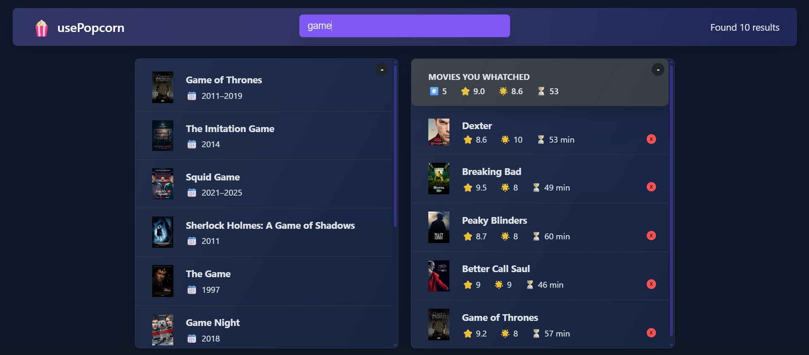

# 🎬 MovieList React App

A **glassmorphism-styled** movie tracker built with React.  
Search movies, rate them, and manage your watched list in a clean, modern UI.

---

## 📷 Preview


---

## 🧰 Table of Contents
- [Features](#-features)  
- [Tech Stack](#-tech-stack)  
- [Getting Started](#-getting-started)  
  - [Installation](#installation)  


---

## 🚀 Features
- 🔍 Search for movies  
- ⭐ Rate movies  
- ✅ Add to “Watched” list  
- 🎨 Modern glassmorphism UI  

---

## 🧱 Tech Stack
- React (Vite)  
- CSS (Glassmorphism design)  
- ESLint  

---


### Installation
```bash
git clone https://github.com/daniHash/movieList-react-app.git
cd movieList-react-app
npm install
npm run dev
